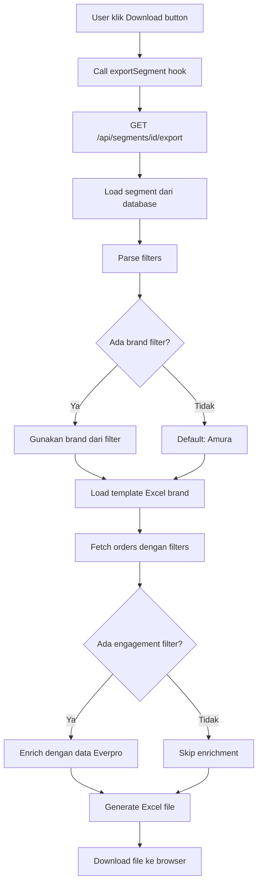

# Export Hasil Segmentasi ke Excel

## Overview

Fitur ini memungkinkan Anda untuk **export hasil segmentasi** (filtered customers/orders) ke Excel menggunakan template yang sesuai dengan brand. Ketika Anda sudah membuat segmentasi dengan berbagai filter, hasil customer yang match dengan filter tersebut dapat di-export ke file Excel dengan format brand-specific.

## Cara Menggunakan

### Dari UI (Dashboard)

1. Buka halaman utama (`/`)
2. Lihat daftar segmentasi yang sudah dibuat
3. Klik tombol **Download** (icon download) pada segmen yang ingin di-export
4. File Excel akan otomatis terdownload dengan format sesuai brand yang ada di filter segmentasi

### Dari Code (Programmatic)

```tsx
import { useSegmentExport } from "@/hooks";

function MyComponent() {
  const { exportSegment, isExporting, error } = useSegmentExport();

  const handleExport = async () => {
    const result = await exportSegment(
      "segment-id-123", 
      "Segment Name"
    );
    
    if (result.success) {
      console.log("Export berhasil!");
    } else {
      console.error("Export gagal:", result.error);
    }
  };

  return (
    <button onClick={handleExport} disabled={isExporting}>
      {isExporting ? "Exporting..." : "Export Segment"}
    </button>
  );
}
```

## Files yang Dibuat

### 1. API Endpoint
**File:** `/src/app/api/segments/[id]/export/route.ts`

**Endpoint:** `GET /api/segments/{segmentId}/export`

**Fungsi:**
- Mengambil segment dari database berdasarkan ID
- Parse filters dari segment
- Menentukan brand dari filter (default: Amura jika tidak ada brand filter)
- Fetch orders yang match dengan semua filters
- Enrich dengan data engagement dari Everpro (jika ada engagement filter)
- Load template Excel sesuai brand
- Generate file Excel dan return sebagai download

### 2. React Hook
**File:** `/src/hooks/useSegmentExport.ts`

**Exports:** `useSegmentExport()`

**Returns:**
- `exportSegment(segmentId, segmentName)`: Fungsi untuk trigger export
- `isExporting`: Boolean untuk loading state
- `error`: Error message jika export gagal

### 3. Update pada Dashboard
**File:** `/src/app/page.tsx`

**Update:**
- Import `useSegmentExport` hook
- Implementasi `handleDownload` untuk call API export
- Update UI button download dengan loading state (spinner animation)
- Disabled button saat sedang export

## Alur Kerja Export



## Template Selection

Sistem secara otomatis memilih template berdasarkan brand yang ada di filter segmentasi:

| Brand Filter | Template File | Output Filename |
|--------------|---------------|-----------------|
| Amura | `OrdersExportAmura.xlsx` | `SegmentName_Amura_2026-03-19.xlsx` |
| Reglow | `OrdersExportReglow.xlsx` | `SegmentName_Reglow_2026-03-19.xlsx` |
| Purela | `OrdersExportPurela.xlsx` | `SegmentName_Purela_2026-03-19.xlsx` |
| Tidak ada / Multiple | `OrdersExportAmura.xlsx` (default) | `SegmentName_Amura_2026-03-19.xlsx` |

## Kolom-Kolom Excel Export

### Kolom Standard (Semua Segment)

| Kolom | Deskripsi | Sumber Data |
|-------|-----------|-------------|
| Order ID | ID order unik | WMS API |
| Reference No | Nomor referensi | WMS API |
| Customer Name | Nama customer | WMS API |
| Customer Phone | Nomor HP customer | WMS API |
| Customer Email | Email customer | WMS API |
| Customer Type | new / repeat / loyal | WMS API |
| Province | Provinsi | WMS API |
| City | Kota | WMS API |
| District | Kecamatan | WMS API |
| Sub District | Kelurahan | WMS API |
| Address | Alamat lengkap | WMS API |
| Brand | Nama brand | WMS API |
| Product | SKU / product summary | WMS API |
| Qty | Jumlah item | WMS API |
| Amount | Total harga | WMS API |
| Discount | Diskon | WMS API |
| Shipping Fee | Ongkir | WMS API |
| COD Fee | Biaya COD | WMS API |
| Payment Method | Metode pembayaran | WMS API |
| Payment Status | Status pembayaran | WMS API |
| Is COD | Yes / No | WMS API |
| Courier | Ekspedisi | WMS API |
| Courier Label | Label kurir | WMS API |
| AWB | Nomor resi | WMS API |
| Customer Service | Nama CS | WMS API |
| CS ID | ID CS | WMS API |
| Ads Platform | Platform iklan | WMS API |
| Ads Platform ID | ID platform | WMS API |
| Warehouse ID | ID gudang | WMS API |
| Note | Catatan order | WMS API |
| Status | Status order | WMS API |
| Status Fulfillment | Status fulfillment | WMS API |
| Status External | Status eksternal | WMS API |
| Created At | Tanggal dibuat | WMS API |
| Order At | Tanggal order | WMS API |
| Leads At | Tanggal leads | WMS API |

### Kolom Tambahan (Jika Ada Engagement Filter)

Jika segmentasi memiliki **engagement filter**, kolom-kolom berikut akan ditambahkan:

| Kolom | Deskripsi | Sumber Data |
|-------|-----------|-------------|
| Last Contact | Tanggal terakhir dihubungi | Everpro Database |
| Blast Status | Sudah / Belum | Everpro Database |
| Engagement Status | contacted / not_contacted / unknown | Everpro Database |

## Contoh Penggunaan

### Scenario 1: Export Segment Amura dengan Date Filter

**Segment:**
- Name: "Amura Q1 2026"
- Filters:
  - Brand: Amura
  - Timeframe: 2026-01-01 to 2026-03-31

**Hasil:**
- Template: `OrdersExportAmura.xlsx`
- File output: `Amura_Q1_2026_Amura_2026-03-19.xlsx`
- Orders: Semua order Amura dari Q1 2026

### Scenario 2: Export Segment Reglow dengan Engagement Filter

**Segment:**
- Name: "Reglow Not Contacted"
- Filters:
  - Brand: Reglow
  - Engagement Status: Belum dihubungi

**Hasil:**
- Template: `OrdersExportReglow.xlsx`
- File output: `Reglow_Not_Contacted_Reglow_2026-03-19.xlsx`
- Orders: Order Reglow yang customernya belum pernah dihubungi
- Extra columns: Last Contact, Blast Status, Engagement Status

### Scenario 3: Export Segment Multi-Filter

**Segment:**
- Name: "High Value Jakarta"
- Filters:
  - Brand: Amura
  - Province: DKI Jakarta
  - Transaction: Amount > 500,000

**Hasil:**
- Template: `OrdersExportAmura.xlsx`
- File output: `High_Value_Jakarta_Amura_2026-03-19.xlsx`
- Orders: Order Amura dari Jakarta dengan nilai > 500k

## API Testing

### Test Basic Export

```bash
# Export segment by ID
curl -OJ "http://localhost:3000/api/segments/clx123abc/export"
```

### Test dengan Postman

1. Method: `GET`
2. URL: `http://localhost:3000/api/segments/{segmentId}/export`
3. Headers: (none required)
4. Expected Response: Excel file download

## Error Handling

Sistem menangani berbagai error scenarios:

| Error | Status Code | Deskripsi | Solusi |
|-------|-------------|-----------|---------|
| Segment not found | 404 | Segment ID tidak ditemukan | Cek segment ID valid |
| Invalid brand | 400 | Brand tidak valid atau tidak ada mapping | Pastikan brand filter valid |
| Template not found | 404 | Template Excel tidak ada | Pastikan file template ada di `/public/templates/` |
| No orders found | 404 | Tidak ada order yang match | Cek filter segmentasi tidak terlalu restrictive |
| Export failed | 500 | Server error | Cek logs untuk detail error |

## Performance & Optimization

### Pagination Handling
- API secara otomatis fetch **semua halaman** dari WMS
- Menggunakan batch fetching dengan page size 100
- Progress ditampilkan di console logs

### Memory Efficiency
- Orders di-process secara streaming
- Template di-load sekali di memory
- File Excel di-generate tanpa intermediate storage

### Engagement Data Enrichment
- Hanya di-fetch jika ada engagement filter dalam segment
- Menggunakan phone number variants matching
- Bulk query untuk efisiensi (1 query untuk semua variants)

## Troubleshooting

### Problem: "Template not found"

**Penyebab:** File template tidak ada di folder `/public/templates/`

**Solusi:**
```bash
# Pastikan files ini ada:
ls -la /Users/ali/crm-sinergi/public/templates/
# Harus ada:
# OrdersExportAmura.xlsx
# OrdersExportReglow.xlsx
```

### Problem: "No orders found"

**Penyebab:** 
- Filter terlalu restrictive
- Brand tidak memiliki orders di WMS

**Solusi:**
- Preview segment dulu sebelum export
- Cek result count > 0 sebelum export
- Verify filters di segment preview

### Problem: Export button tidak respond

**Penyebab:** API masih fetching data (bisa memakan waktu untuk segment besar)

**Solusi:**
- Tunggu hingga loading selesai
- Cek console browser untuk error
- Cek server logs: `npm run dev`

### Problem: File Excel corrupt atau tidak bisa dibuka

**Penyebab:**
- Template Excel tidak valid
- Memory issue saat generate

**Solusi:**
- Verify template file bisa dibuka di Excel
- Cek ukuran segment tidak terlalu besar (> 10,000 orders)
- Clear browser cache dan retry

## Integration dengan Feature Lain

### Dengan Segment Preview
- User bisa preview results sebelum export
- Export hanya aktif jika segment sudah saved

### Dengan WMS API
- Menggunakan `fetchOrdersEfficiently()` untuk optimal fetching
- Respects semua filters yang ada di segment
- Automatic retry pada network errors

### Dengan Everpro Sync
- Engagement data diambil dari Everpro database
- Phone number matching menggunakan variants (62, +62, 0)
- Last contact date dan blast status included

## Future Enhancements

Potensi improvement untuk masa depan:

1. **Async Export untuk Large Segments**
   - Background job processing
   - Email notification saat selesai

2. **Custom Column Selection**
   - User bisa pilih kolom mana yang mau di-export
   - Save column preferences

3. **Multiple Format Support**
   - CSV export
   - PDF export
   - Google Sheets integration

4. **Export History**
   - Track export history per user
   - Re-download previous exports

5. **Scheduled Exports**
   - Auto-export segment secara berkala
   - Email delivery

6. **Export Analytics**
   - Track most exported segments
   - Export performance metrics

## Dependencies

```json
{
  "xlsx": "^0.18.5",
  "@prisma/client": "^6.19.2",
  "next": "16.1.6"
}
```

## Environment Variables

Tidak ada environment variables tambahan yang diperlukan untuk fitur ini. Menggunakan config yang sama dengan WMS API:

```env
WMS_API_KEY=your_api_key
WMS_API_BASE_URL=https://wms-api.sinergisuperapp.com
DATABASE_URL=your_postgres_url
```

---

**Dibuat:** 19 Maret 2026  
**Status:** ✅ Production Ready  
**Maintainer:** CRM Sinergi Team
